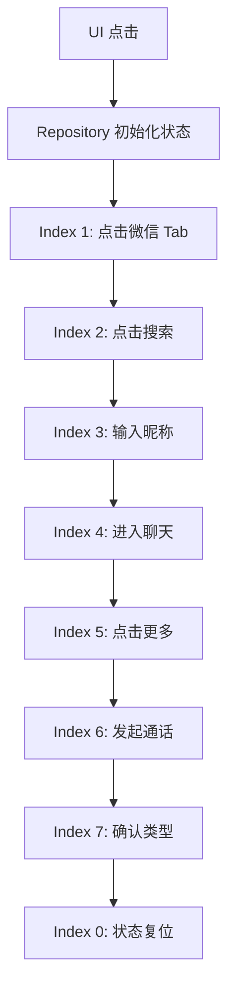

# 项目知识传承手册 (Project Onboarding)

本手册旨在为进入 SimpleDesktop 项目的 AI 智能体提供即时的背景知识和硬性开发约束。

## 1. 核心技术栈
- **UI 框架**：Jetpack Compose (声明式 UI)
- **依赖注入**：Hilt (Dagger)
- **持久化**：Room (Database) / DataStore (Preferences)
- **网络层**：Retrofit / OkHttp
- **依赖管理**：Gradle Version Catalog (`libs.versions.toml`)

## 2. 关键架构设计
- **全局配置中心 (AppConfig)**：
  - 路径：`app/src/main/java/tech/huangsh/onetap/config/AppConfig.kt`
  - 准则：所有业务常量、API URL、超时设置必须在此定义，严禁硬编码。
- **单文件图标方案 (Adaptive Icons)**：
  - 路径：`app/src/main/res/drawable-nodpi/ic_app_launcher_source.png`
  - 准则：修改图标仅允许替换该单一 PNG 文件。
- **插件系统**：
  - 遵循 `IPlugin` 接口，支持动态功能扩展。

## 3. 核心业务流程详解：微信自动通话
这是项目中最复杂的自动化逻辑，采用“**状态机 + 无障碍模拟点击**”实现。

### 3.1 预触发阶段 (Repository)
1. 校验无障碍服务 `SelectToSpeakService` 是否开启。
2. 将目标联系人 `wechatNickname` 和通话类型同步到 `WeChatData` 全局单例。
3. 设置 `WeChatData.index = 1` 激活状态机，并启动微信 `LauncherUI`。

### 3.2 自动化执行阶段 (Accessibility Service)
由 `SelectToSpeakService` 监听微信包名并执行以下 7 个状态转换：
- **Index 1**: 进入微信首页，点击底部第一个 Tab（微信）。
- **Index 2**: 点击右上角搜索图标。
- **Index 3**: 在搜索框输入目标昵称。
- **Index 4**: 点击搜索结果列表的第一项。
- **Index 5**: 进入聊天界面，点击右下角“+”（更多）按钮。
- **Index 6**: 在弹出菜单中定位“视频通话”按钮坐标并模拟点击。
- **Index 7**: 在最终弹出的“视频通话/语音通话”选项中，根据配置点击对应文本。

## 4. 开发闭环规范 (最高优先级)
1. **中文开发标准**：严格遵守 `zh-cn-dev-standard` (英文代码标识符 + 中文文档/注释)。
2. **文档归口**：所有 Markdown 文档必须存放在 `docs/` 目录下。
3. **文档即代码**：**任何功能的实现或修改，必须同步更新对应的文档**（如 `docs/NEW_FEATURES.md` 或 `docs/PLUGIN_ARCHITECTURE.md`）。文档滞后被视为开发失败。

## 4. 常用目录索引
- `docs/` - 所有的项目文档与路线图。
- `.agent/skills/` - 本地化的智能体技能定义。
- `.learnings/` - AI 自我改进的偏差记录。
