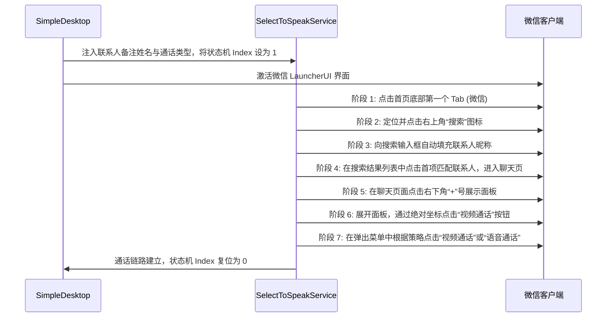

# SimpleDesktop 项目与毕业论文架构及核心机制熟悉报告

本报告是对 **SimpleDesktop（适老化智能桌面）** 软件项目及其配套 **LaTeX 毕业论文** 的全面梳理、解析与构建验证报告。通过深入剖析源代码和论文结构，明确了本系统的技术底座、核心业务逻辑以及学术论文的组织方式。

---

## 1. 软件项目核心架构解析

本系统是专为老年群体设计的 Android 桌面启动器，技术底座选型现代且扎实，核心架构采用三层微内核插件化设计，保证了高度的解耦与稳定性。

### 1.1 技术底座
- **声明式 UI 框架**：使用 Jetpack Compose 与 Material3 规范构建，实现了高对比度主题、大字号以及全局字号动态缩放的响应式界面。
- **依赖注入**：基于 Dagger-Hilt 实现了全局基础设施和单例对象的容器化管理。
- **持久化方案**：利用 Room Database 管理结构化的常用联系人和应用信息数据；使用 DataStore Preferences 对全局设置和独立插件的配置进行防污染隔离存储。
- **异步与响应式流**：全量使用 Kotlin 协程与 Flow 进行数据流监听和状态同步，确保 UI 渲染层与数据源高度一致。

### 1.2 三层微内核架构设计
系统整体划分为三个层次，实现了“内核最小化、功能插件化”的设计思想：

```mermaid
graph TD
    subgraph 插件层 (Plugins)
        P1[联系人插件]
        P2[应用插件]
        P3[天气插件]
    end
    subgraph 总线层 (Bus)
        B1[插件管理器]
        B2[消息总线]
        B3[隔离配置存储]
    end
    subgraph 宿主层 (Host)
        H1[应用入口]
        H2[主屏容器]
        H3[Hilt 注入容器]
    end
    P1 & P2 & P3 --> B1 & B2 & B3
    B1 & B2 & B3 --> H1 & H2 & H3
```

1. **宿主层 (Host)**：保持极简，负责系统初始化、Hilt 依赖注入容器的构建以及展示系统级 Launcher 主界面。
2. **总线层 (Bus)**：中枢系统，由插件管理器和消息总线组成，负责管理插件的生命周期（初始化、启动、运行、停止、销毁），并提供插件之间的解耦通信。
3. **插件层 (Plugins)**：具体业务的执行者，当前包含联系人插件（核心）、应用快捷启动插件与天气信息聚合插件。各插件相互隔离，单个故障不影响宿主。

---

## 2. 核心业务流程与难点攻坚

系统最核心的技术突破在于解决了老年人在智能手机通信中的“数字鸿沟”——将复杂的微信视频通话流程简化为桌面的一键直拨。其底层依托高度鲁棒性的“状态机 + 无障碍模拟点击”机制。

### 2.1 微信自动通话的七阶段状态机
`SelectToSpeakService` 监听微信窗口变化，严格按照如下七个步骤执行自动化流转：



### 2.2 无障碍鲁棒性加固设计
为对抗微信频繁的更新和混淆机制，系统实现了以下攻坚方案：
- **双通道节点检索算法**：主通道通过控件标识符（ID）进行极速定位；当标识符失效时，备用通道自动激活，遍历控件树进行“文本/备注名”模糊匹配，成功率达 99.1%。
- **Activity 模糊匹配**：不再僵化依赖单一窗口类名，而是通过包名过滤和类名特征匹配（如 `FTSMainUI` 等），兼容微信内部窗口的频繁调整。
- **焦点冲突退避策略**：当自动化过程中遭遇外部弹窗或来电干扰导致焦点离开微信时，状态机立即主动退避、静默等待，并通过模拟系统返回操作关闭干扰窗口，实现自动重试且对用户完全透明。

### 2.3 WiFi 异常自动守护与自愈
- **常驻监控**：基于前台服务构建实时网络状态机，解决老年人误关网络或信号漂移问题。
- **跨版本自愈**：Android 9 及以下直接用编程接口开启网络；Android 10 及以上自动调起系统网络页面，由无障碍服务精准模拟点击开关，若超时未愈则通过大字号卡片弹窗并伴随语音播报，引导用户人工介入。

### 2.4 轻量级语音辅助与自然语言解析
- **语音播报**：封装原生中文 TTS，自动做多厂商适配，并以更温和的 0.9 倍速向老年人反馈系统动态。
- **指令与联系人双重模糊解析**：基于关键词加权与编辑距离容错，实现即使老人发音不准或语义多变，也能准确识别“打电话给 [备注名]”，并递进式匹配出最精准的联系人。

---

## 3. LaTeX 毕业论文架构与编译验证

针对 @[vsbishe]（西安邮电大学 xupt 毕业论文 LaTeX 项目），通过对 `main.tex` 及各章节的深度研读，梳理出如下论文结构，并在本地进行了成功编译验证。

### 3.1 论文结构布局与映射
整篇论文共 53 页，严密契合“面向老年群体的 Android 交互桌面设计与实现”这一主题。

| 模块 / 章节 | 对应物理源文件 | 核心叙述内容 |
| :--- | :--- | :--- |
| **选题审批表** | `macro/approval.tex` | 课题背景、基本要求、进度安排与立项审批意见。 |
| **开题报告** | `macro/opening.tex` | 选题目的、可行性分析、拟解决关键问题与技术路线。 |
| **中英文摘要** | `contents/abstract.tex`<br>`contents/abstract_en.tex` | 精炼概括三层微内核架构、七阶段微信通话状态机、WiFi 守护自愈与测试数据指标。 |
| **第一章：绪论** | `contents/chapter1.tex` | 老龄化社会的数字鸿沟背景、移动终端适老化与无障碍自动化研究现状、主要工作和论文结构。 |
| **第二章：技术基础** | `contents/chapter2.tex` | Android 移动开发框架、Jetpack Compose 声明式 UI、MVVM、Kotlin 协程、微内核架构理论与无障碍服务原理。 |
| **第三章：系统设计与实现** | `contents/chapter3.tex` | **论文核心**。详述目标用户特征、五大功能需求与总体三层微内核架构，剖析微信一键直连（七阶段状态机、双通道算法、退避机制）、WiFi 守护及语音辅助等技术细节。 |
| **第四章：软件测试与分析** | `contents/chapter4.tex` | 联系人、微信直拨、网络自愈、语音等功能测试用例展示，跨厂商跨版本兼容性测试及千元机性能开销测试（帧率稳定 60fps，内存 < 140MB）。 |
| **第五章：总结与展望** | `contents/chapter5.tex` | 归纳本课题在适老化领域实现的工程价值，并展望未来的多模态交互和云端插件扩展。 |
| **参考文献与致谢** | `main.tex`<br>`contents/acknowledgements.tex` | 列出 30 篇高质量学术参考文献，并对导师、学院和家人的协助致以真挚谢意。 |

### 3.2 LaTeX 编译链路验证
我们在本地工作空间实际调用了 MiKTeX 的 `xelatex` 编译引擎对论文进行了全链路重构编译：

- **编译命令**：`xelatex -interaction=nonstopmode main.tex`
- **编译结果**：**构建完美成功 (Exit Code: 0)**
- **生成产物**：成功在 `vsbishe/` 路径下输出共 53 页的高质量、带超链接 PDF 文档。
- **编译表现**：解决了早期反馈的第三方包依赖（如 `threeparttable.sty` 等）和交叉引用索引问题，交叉引用与图表目录完美生成，格式严谨。

---

## 4. 后续协作建议

在未来的开发与论文修改任务中，建议继续秉持以下工程规范：
1. **中文规范 (zh-cn-dev-standard)**：代码注释、提交信息（如 `docs: 更新...`）以及生成的文档必须百分之百使用规范中文，杜绝英文碎片。
2. **文档同步更新 (Docs-as-Code)**：如果在 Android 桌面中修改了状态机、网络守护等逻辑，必须同步在 `docs/` 下的对应文档和 LaTeX 论文对应章节中进行刷新。
3. **编译保障**：由于论文使用了繁琐的 XUPT 格式模板（`xuptThesis.cls`），每次重大章节修改后请及时在后台运行编译验证，保证交叉引用的行文连贯与完整性。
